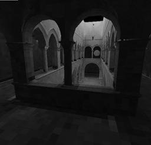

SCEJS
============

<h1>Multipurpose Javascript 3D graphic library</h1>

SCEJS use <a href="https://github.com/stormcolor/webclgl">WebCLGL</a> to facilitate perform advanced algorithms as modules for this library.
<h3>Current Algorithms:</h3>
<h3>GPU Graph</h3>
- WebGL Graph visualization and Real Time Force Layout using Adjacency Matrix.
<h3>GPU Neural Network</h3>
- Method to perform GPU backward/forward along entire Neural Network layers with an Adjacency Matrix instead send data layer by layer. (March 31 2018) 
- <a href="https://github.com/karpathy/convnetjs">ConvNetJS</a> Reinforcement Learning module integration. (March 31 2018) 
- Fast GPU batch integration (April 2 2018)
<h3>GPU Path Tracing</h3>
- Tool to voxelizate triangles meshes using WebGL top view for celling creation 
- Hybrid PathTracing using voxels instead triangles.

<h2>DEMOS</h2>
 
<a href="http://stormcolour.appspot.com/scejs/demos/basic/index.html">- Basic</a> 
 
<a href="http://stormcolour.appspot.com/scejs/demos/graph/index.html">- Graph</a> 
  
 
<a href="http://stormcolour.appspot.com/scejs/demos/graph-rb-files/index.html">- Graph from RB files</a> 
  
 
<a href="http://stormcolour.appspot.com/scejs/demos/graph-custom-layout/index.html">- Graph Custom</a> 
  
 
<a href="http://stormcolour.appspot.com/scejs/demos/graph-neuronal-network/">- Neuronal Network. Basic</a> 
  
 
<a href="http://stormcolour.appspot.com/scejs/demos/gbrain-reinforcement-learning/">- Neuronal Network. ConvNet Reinforcement Learning demo integration</a> 
  
 
<a href="http://stormcolour.appspot.com/scejs/demos/voxels-path-tracing/index.html">- Voxels Path-Tracing</a> 
  

 
 
<h2><a href="https://rawgit.com/stormcolor/SCEJS/master/APIdoc/APIdoc/SCE.html">API Doc</a></h2>
 